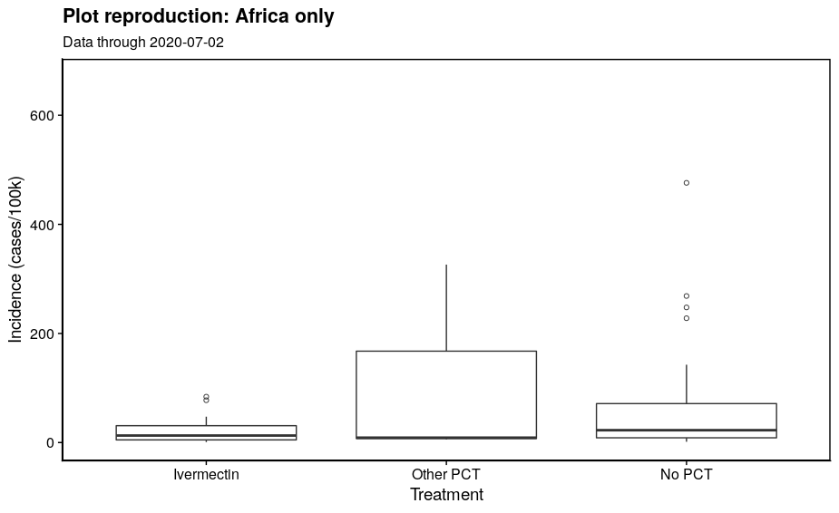
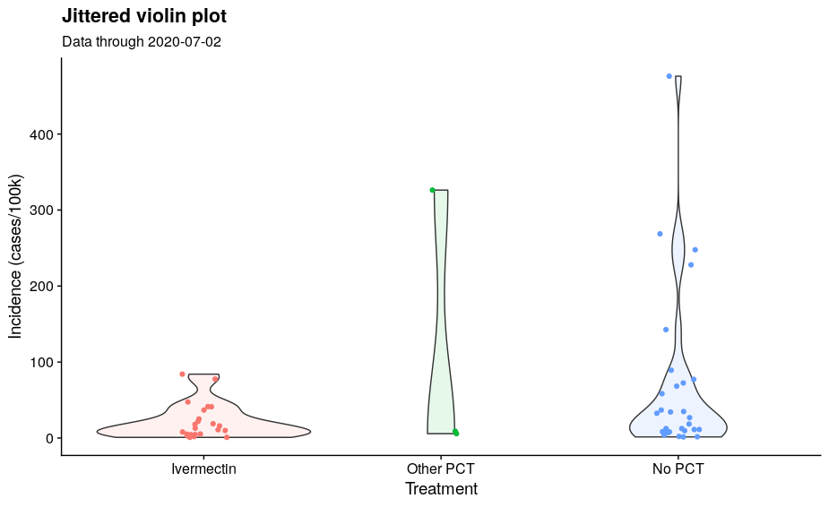
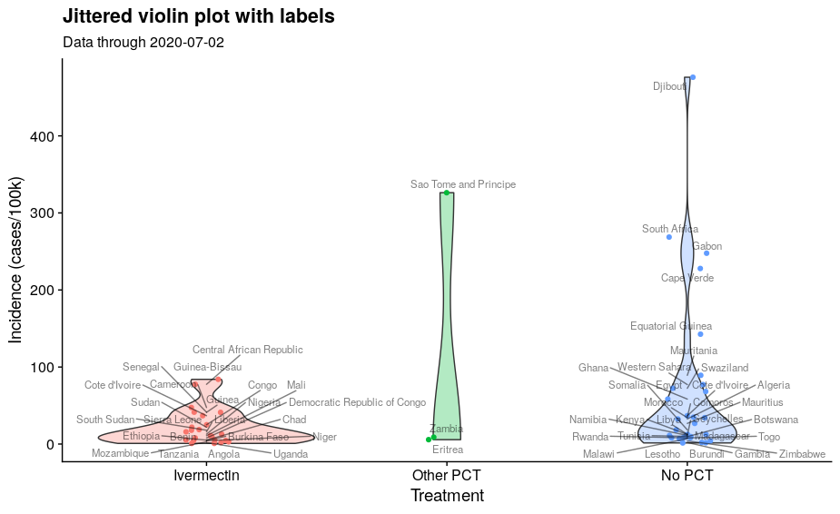
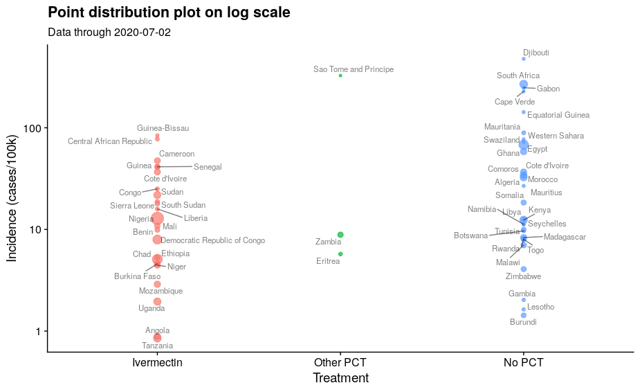

Ivermectin exploration
================
2020-07-01

``` r
## Load libraries
library(ggplot2)
library(lubridate)
library(dplyr)
library(ggplot2)
library(RColorBrewer)
library(readr)
library(tidyr)
library(readxl)
library(xml2)

options(scipen = '999')
```

``` r
# Read in data
cl0 <- read_excel('data/country list.xlsx')
cl1 <- read_excel('data/country list (1).xlsx')
oncho <- xml2::read_xml('data/Oncho data.xml')
lf <- read_excel('data/LF_data.xlsx')
# Get our world in data 
owid <- read_csv('https://covid.ourworldindata.org/data/owid-covid-data.csv')
```

``` r
# Define which countries are PCT, etc. Only using Africa
african_countries <- sort(unique(c(cl0$Ivermectin,
                                 cl0$`Other PCT treatment`,
                                 cl0$`No PCT`)))
africa <- 
  bind_rows(
    tibble(country = cl0$Ivermectin,
           key = 'Ivermectin'),
    tibble(country = cl0$`Other PCT treatment`,
           key = 'Other PCT treatment'),
    tibble(country = cl0$`No PCT`,
           key = 'No PCT') %>% 
      # Remove those incorrectly coded as both PCT and Iver
      filter(!country %in% c('Sierra Leone', 'Senegal'))
  ) %>%
  filter(!is.na(key),
         !is.na(country))

# Remove sub-national regions
africa <- africa %>%
  filter(!country %in% c('Mayotte (France)',
                         'Reunion (France)',
                         'Saint Helena, Ascension and Tristan da Cunha (UK)'))

# Recode some country names
# cat(paste0("'",
#            africa$country[!africa$country %in% owid$location],
#            "' = ''\n"))

africa <- africa %>%
  mutate(country = recode(country,
                          'Côte d\'Ivoire' = 'Cote d\'Ivoire',
                           'Democratic Republic of the Congo' = 'Democratic Republic of Congo',
                           'United Republic of Tanzania' = 'Tanzania',
                           'Ivory Coast' = 'Cote d\'Ivoire'))
```

``` r
# Reformat data for better plotting
pd <- owid %>% left_join(africa,
                         by = c('location'='country')) %>%
  filter(!is.na(key))

# Get cumulative incidence per 100k
pd <- pd %>%
  filter(date == max(date)) %>%
  mutate(ci = total_cases_per_million * 10)

# Relevel
pd$Treatment <- factor(pd$key,
                       levels = c('Ivermectin', 'Other PCT treatment',
                                  'No PCT'),
                       labels = c('Ivermectin', 'Other PCT',
                                  'No PCT'))

# Plot
ggplot(data = pd,
       aes(x = Treatment,
           y = ci)) +
  geom_boxplot() +
  cowplot::theme_cowplot() +
  labs(y = 'Incidence (cases/100k)',
       title = 'Plot reproduction: Africa only',
       subtitle = paste0('Data through ', max(pd$date)))
```

<!-- -->

# Plot improvement

``` r
library(ggridges)
ggplot(data = pd) +
  geom_density_ridges(
    aes(x = ci,
           y = Treatment,
        fill = Treatment)
  ) +
  cowplot::theme_cowplot() +
  labs(x = 'Incidence (cases/100k)',
       title = 'Ridgeline plot',
       subtitle = paste0('Data through ', max(pd$date))) +
  theme(legend.position = 'none')
```

<!-- -->

``` r
ggplot(data = pd,
       aes(x = Treatment,
           y = ci)) +
  geom_violin(aes(fill = Treatment),
              alpha = 0.1) +
  geom_jitter(height = 0, width = 0.1,
              aes(color = Treatment)) +
  cowplot::theme_cowplot() +
  labs(y = 'Incidence (cases/100k)',
       title = 'Jittered violin plot',
       subtitle = paste0('Data through ', max(pd$date))) +
  theme(legend.position = 'none')
```

<!-- -->

``` r
library(ggrepel)
ggplot(data = pd,
       aes(x = Treatment,
           y = ci)) +
  geom_violin(aes(fill = Treatment),
              alpha = 0.3) +
  geom_jitter(height = 0, width = 0.1,
              aes(color = Treatment)) +
  cowplot::theme_cowplot() +
  labs(y = 'Incidence (cases/100k)',
       title = 'Jittered violin plot with labels',
       subtitle = paste0('Data through ', max(pd$date))) +
  theme(legend.position = 'none') +
  geom_text_repel(aes(label = location),
                  alpha = 0.5,
                  size = 4)
```

<!-- -->

## Discussion

All of the above distributions weight each country equally, even though
countries have far different population sizes. Population sizes shown
below

``` r
library(ggrepel)
ggplot(data = pd,
       aes(x = Treatment,
           y = ci)) +
  # geom_violin(aes(fill = Treatment),
  #             alpha = 0.3) +
  geom_jitter(height = 0, width = 0,
              aes(color = Treatment,
                  size = population),
              alpha = 0.7) +
  cowplot::theme_cowplot() +
  labs(y = 'Incidence (cases/100k)',
       title = 'Point distribution plot on log scale',
       subtitle = paste0('Data through ', max(pd$date))) +
  theme(legend.position = 'none') +
  geom_text_repel(aes(label = location),
                  alpha = 0.5,
                  size = 4) +
  scale_y_log10()
```

<!-- -->

Another way to look at population…

``` r
ggplot(data = pd,
       aes(x = population,
           y = ci,
           color = Treatment)) +
  geom_point() +
    cowplot::theme_cowplot() +
  labs(y = 'Incidence (cases/100k)',
       title = 'Population and cumulative incidence on log scale',
       subtitle = paste0('Data through ', max(pd$date))) +
  scale_y_log10() +
  scale_x_log10() +
    geom_text_repel(aes(label = location),
                  alpha = 0.5,
                  size = 4)
```

<!-- -->

Maybe we just need a simple multivariate model. Does being of one type
of “treatment” predict cumulative incidence?

``` r
fit <- lm(ci ~ Treatment, data = pd)
broom::tidy(summary(fit))
```

    # A tibble: 3 x 5
      term               estimate std.error statistic p.value
      <chr>                 <dbl>     <dbl>     <dbl>   <dbl>
    1 (Intercept)           2126.     1811.      1.17  0.246 
    2 TreatmentOther PCT    9214.     5330.      1.73  0.0897
    3 TreatmentNo PCT       4423.     2407.      1.84  0.0717

In the above, the reference class is ivermectin. Cumulative invidence is
greater in the other two groups, p \> 0.05.
